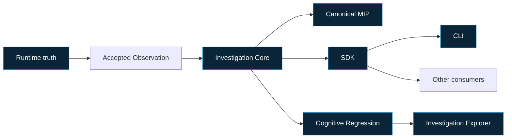

# MemoryOS Standard 1.0

**Identifier:** CCA-MEMORYOS-1.0  
**Version:** 1.0  
**Status:** Published  
**Publication date:** 2026-09-05  
**Publication milestone:** MO-1208  
**Scope:** Deterministic MemoryOS platform behavior and conformance

## 1. Purpose

CCA-MEMORYOS-1.0 is the authoritative, implementation-independent standard
for the observable behavior of MemoryOS. It freezes the platform behavior
established through MemoryOS 1.2 without making the current implementation,
its source languages, or its repository layout part of the standard.

The Standard enables an independent implementation to produce, consume, and
investigate the same deterministic cognition; expose compatible SDK and CLI
boundaries; and demonstrate conformance with reproducible evidence.

## 2. Normative status

This document and the documents marked **Normative** in section 5 are
normative. Text explicitly marked **Informative**, diagrams, examples, and the
Reference Implementation Guide are informative.

The key words **MUST**, **MUST NOT**, **SHOULD**, **SHOULD NOT**, and **MAY**
express requirement strength. `MUST` and `MUST NOT` define conditions for a
CCA-MEMORYOS-1.0 conformance claim. Every MemoryOS-specific mandatory
statement has a stable `CCA-MOS-*` identifier in
[requirements.yaml](requirements.yaml).

The Standard also incorporates two frozen standards by reference:

- all `CCA-RF-001` through `CCA-RF-040` requirements in CCA-RF-1.0; and
- all `CCA-MIP-001` through `CCA-MIP-064` requirements in CCA-MIP-1.0.

Their identifiers remain authoritative and are not duplicated as
`CCA-MOS-*` requirements.

## 3. Scope

### 3.1 In scope

The Standard defines:

- the MemoryOS-observable Runtime truth boundary;
- the deterministic investigation lifecycle;
- use of the canonical Memory Investigation Package;
- provider-independent AI Runtime Adapter behavior;
- the Investigation Core as the sole investigation execution authority;
- canonical native investigation artifacts and their deterministic controls;
- the conditional CCA Studio native Observation projection profile;
- SDK and CLI behavior;
- deterministic Cognitive Regression;
- deterministic Cognitive Investigation Explorer navigation;
- compatibility, versioning, conformance, and certification; and
- the relationship between the Standard and its Reference Implementation.

### 3.2 Out of scope

The Standard does not prescribe source languages, private types, private
algorithms, container choices, processes, threads, storage, network transport,
user interface composition, renderer design, animation, styling, build
systems, or repository organization. Canonicalization, fingerprinting,
ordering, alignment, and stable-world behavior explicitly required by a
normative contract remain observable Standard behavior regardless of the
internal algorithm used to produce it.

The Standard does not add Time Machine, counterfactual behavior, semantic
zoom, AI-generated explanation, heuristic ranking, prediction, reasoning, or
new Runtime semantics. An excluded concern is not authorized by silence.

## 4. Platform boundary

MemoryOS observes cognition without replacing its source. The source Runtime
owns cognition. The Investigation Core owns deterministic investigation
execution. MIP owns portable package semantics. The SDK owns programmability.
The CLI owns automation. Regression reports deterministic differences. The
Explorer navigates evidence already present in a Regression Report.

The diagram is informative. The normative dependency and ownership rules are
in the component specifications.

## 5. Publication set

| Document | Status | Subject |
|---|---|---|
| [runtime-behavior.md](runtime-behavior.md) | Normative | MemoryOS-observable Runtime truth and isolation |
| [investigation-lifecycle.md](investigation-lifecycle.md) | Normative | Investigation state, transitions, Replay, comparison, verification, and archive |
| [mip-contract.md](mip-contract.md) | Normative | Incorporation and use of CCA-MIP-1.0 |
| [adapter-contract.md](adapter-contract.md) | Normative | AI Runtime Adapter boundary |
| [investigation-core.md](investigation-core.md) | Normative | Single investigation execution authority |
| [native-artifacts.md](native-artifacts.md) | Normative | Native Observation, Trace, Replay, Evolution, and Comparative Reconstruction artifacts |
| [native-observation-profile.md](native-observation-profile.md) | Normative for a claim declaring the profile | Exact `cca-studio-native-observation` 1.1.0 snapshot-to-Frame projection and Frame-to-Trace bindings |
| [sdk-contract.md](sdk-contract.md) | Normative | Public programming facade |
| [cli-contract.md](cli-contract.md) | Normative | Scriptable command-line behavior |
| [cognitive-regression.md](cognitive-regression.md) | Normative | Deterministic factual comparison |
| [investigation-explorer.md](investigation-explorer.md) | Normative | Deterministic evidence navigation |
| [requirements.yaml](requirements.yaml) | Normative | Machine-readable MemoryOS requirements and incorporated ranges |
| [conformance.md](conformance.md) | Normative | Conformance targets, evidence, and report rules |
| [compatibility.md](compatibility.md) | Normative | Compatibility guarantees |
| [versioning.md](versioning.md) | Normative | Independent version identities and change classification |
| [certification.md](certification.md) | Normative | Assessment and certification procedure |
| [reference-implementation.md](reference-implementation.md) | Informative | Reference Implementation identity and evidence guide |
| [CHANGELOG.md](CHANGELOG.md) | Informative | Publication history |

## 6. Incorporated standards

### 6.1 Runtime Foundation

CCA-RF-1.0 remains authoritative for the CCA Runtime Foundation. This Standard
incorporates `CCA-RF-001` through `CCA-RF-040` without restating the Runtime
component set or lifecycle. The incorporated publication is identified by:

| Artifact | SHA-256 of repository bytes |
|---|---|
| `CCA-RF-1.0/README.md` | `311ea06c21fe551bce6e9ac207090ff8c80b84f285fbdc37dc5cee28c10995b9` |
| `CCA-RF-1.0/requirements.yaml` | `c1505f5b2b0cf69865a605d60a94279bcf73fa57310bedfcd29102f7f9830aa8` |
| `CCA-RF-1.0/conformance.md` | `4589adceb0ff8cc5feb77315fcbd12f82643c710a1d7413d61e7f02eda695bfa` |
| `CCA-RF-1.0/decisions.md` | `4bfb9466cd082d683464b8f08ad46ea231d8c0376b7debac97b0daa4d9c54e2b` |

The MemoryOS-specific Runtime contract adds only the observation boundary in
[runtime-behavior.md](runtime-behavior.md).

### 6.2 Memory Investigation Package

CCA-MIP-1.0 remains authoritative for the `.mip` contract. This Standard
incorporates `CCA-MIP-001` through `CCA-MIP-064` by reference. The exact frozen
publication used by CCA-MEMORYOS-1.0 is identified by:

| Artifact | SHA-256 of repository bytes |
|---|---|
| `CCA-MIP-1.0/MIP-001.md` | `12566acd86cd34bac08db9c88bbbfcc123b19632dfeb9ae8a6d012663c76df50` |
| `CCA-MIP-1.0/requirements.yaml` | `4238525e7936376d7ea057c31266dd39c6379da471b4a6e7b09c6bee78e738af` |
| `CCA-MIP-1.0/schema/memory-investigation-package-1.0.schema.json` | `beea4722bf0071f0c0cf3291cea1f99797f67dba81662cf0bc51f737f4016df6` |
| `CCA-MIP-1.0/conformance.md` | `7829f8df74e6893cac4939c99a641b2f5808fc0e1c94363a43d5710a114ab424` |

The frozen CCA-MIP source files retain their historical draft metadata.
MO-1208 does not rewrite those files. For CCA-MEMORYOS-1.0 conformance, the
exact digest-pinned publication and its complete requirement range are
normatively incorporated regardless of that historical metadata.

## 7. Architectural invariants

- Runtime truth is never replaced by an investigation projection.
- One investigation belongs to exactly one Workspace for its lifetime.
- The Investigation Core is the only investigation execution authority.
- MIP is the only portable cognition package contract.
- SDK and CLI clients delegate; they do not reimplement investigation logic.
- Regression compares cognition, never rendering, layout, or pixels.
- Explorer navigation terminates at evidence already represented by a valid
  Regression Report.
- All observable platform behavior is deterministic for equivalent inputs and
  initial state.
- Failure publishes no partial semantic result and does not mutate accepted
  source cognition.

## 8. Conformance

A complete `CCA-MEMORYOS-1.0 Conformant` claim covers every `CCA-MOS-*`
requirement and both incorporated requirement ranges, with no
`NOT APPLICABLE` result. A component may publish a scoped assessment only when
it names the component profile, retains one report row for every requirement
in that complete registry, and does not imply complete platform conformance.

The official result vocabulary is `PASS`, `FAIL`, and `NOT APPLICABLE`.
Evidence and certification rules are defined in
[conformance.md](conformance.md) and [certification.md](certification.md).

## 9. References

- [CCA Engineering Handbook 1.0](../CCA-ENG-1.0/README.md)
- [CCA Runtime Foundation 1.0](../CCA-RF-1.0/README.md)
- [Memory Investigation Package 1.0](../CCA-MIP-1.0/MIP-001.md)
- CCA-ARCH-1.0 — Platform Constitution
- CCA-LEX-1.0 — Constitutional Lexicon
- CCA-GOV-1.0 — Constitutional Governance
- CCA-ENG-2.0 — Engineering Lifecycle

## 10. Version history

| Version | Date | Status | Summary |
|---|---|---|---|
| 1.0 | 2026-09-05 | Published | Initial MemoryOS platform behavior and conformance Standard. |
